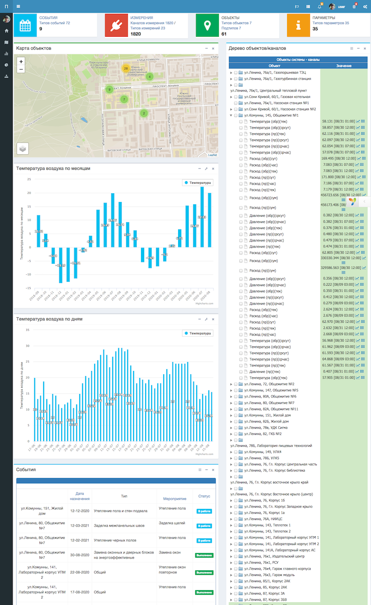
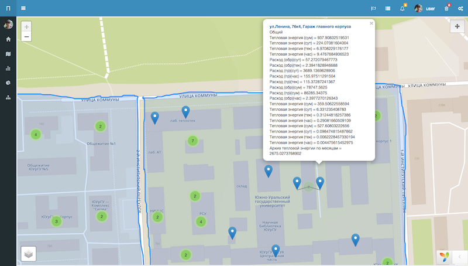
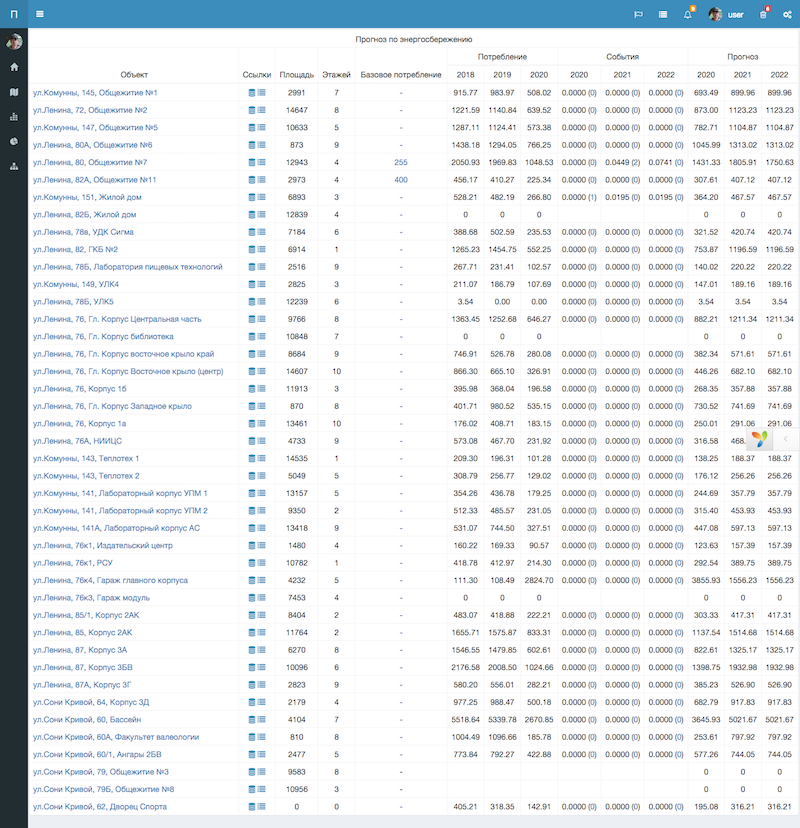

Data analysis system for energy consumption of infrastructure facilities.

An integrated self-adjusting control system for a complex technological complex of production, transmission and consumption of heat energy and water based on BIM and BEM technologies using predictive data analysis of wireless sensors and intelligent microprocessor devices.

Server software for an integrated self-adjusting control system for a complex technological complex of production, transmission and consumption of heat energy and water based on BIM and BEM technologies using predictive data analysis of wireless sensors and intelligent microprocessor devices. The system is designed to carry out the functions of analysis, forecasting, prompt notification and work on various scales from a city district to a region.

The software is a set of software and hardware, which is a server and a set of workstations that allow operators, users and administrators from among the service personnel to carry out the necessary functions of managing the system for visualizing data on energy consumption.

The complex provides a single point of web access for users of the system to all the necessary information with delimitation of levels of access to data.
The main functions of the server of this system are storing the received information, analyzing the received data, informing operators about emergency situations and making decisions to improve energy efficiency.

Dashboard

Map

One of many tables

